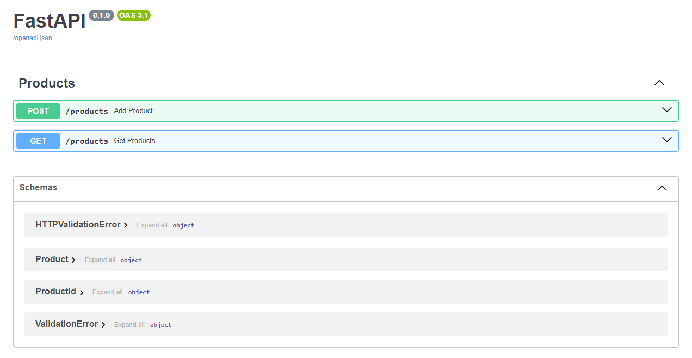

<h1>FastAPI App with Docker</h1>

This is a small application built with FastAPI, uvicorn, aiosqlite, and sqlalchemy.

The app showcases a customizable product list, adaptable to your needs.

Crafted for educational and demonstration purposes.

<h3>Installation instructions:</h3>

git clone https://github.com/prokann02/fastapi_app.git

cd fastapi_app

docker build -t fastapi-app .

docker run -d -p 80:80 fastapi-app

Once the container is running, you can access the FastAPI application at 
<b><a href="http://localhost:80">http://localhost:80</a></b>.

To see page with which you can interact, click <b><a href="http://localhost:80/docs">http://localhost:80/docs</a></b>.

You will see:

